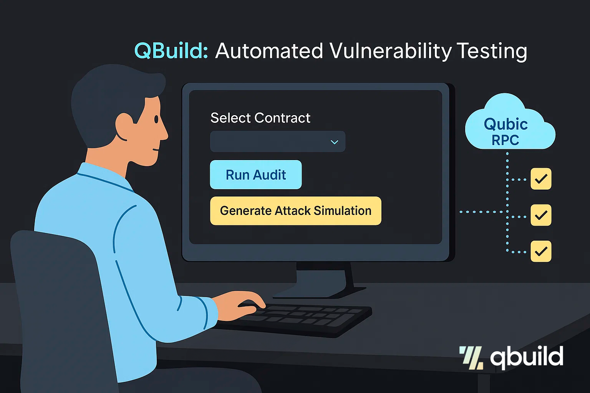
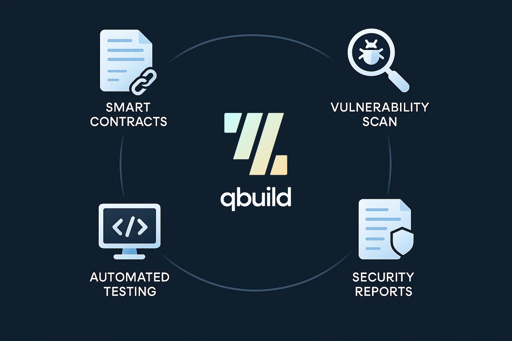
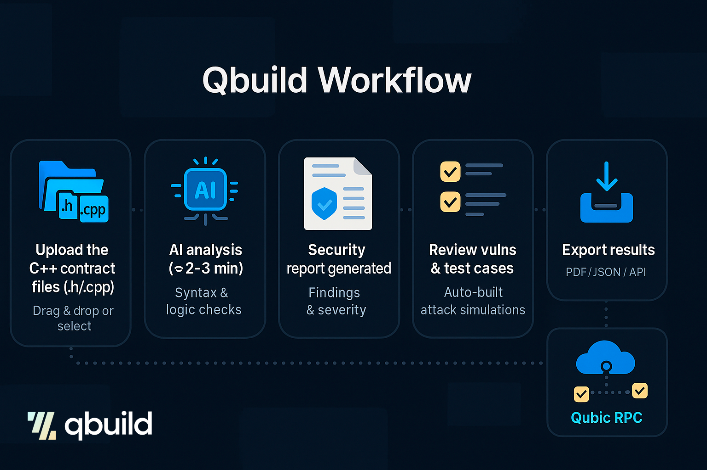
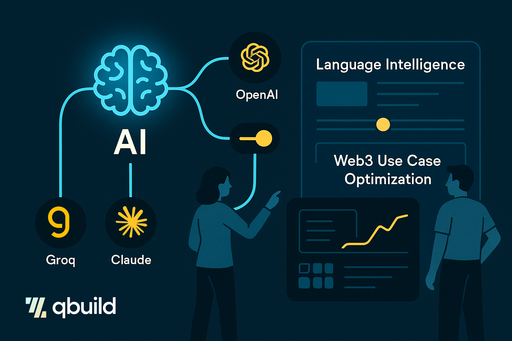
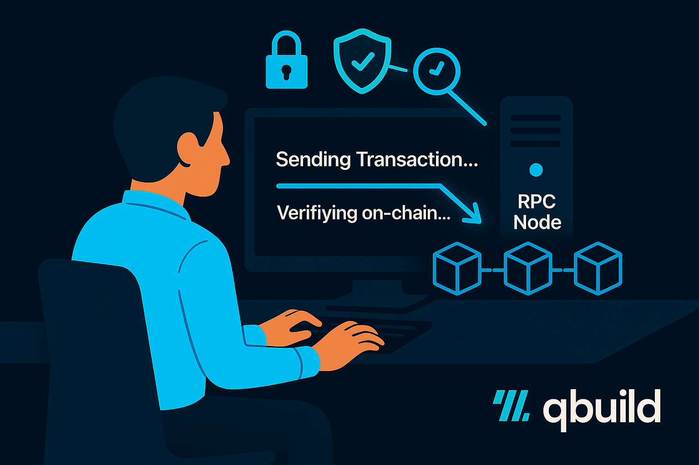
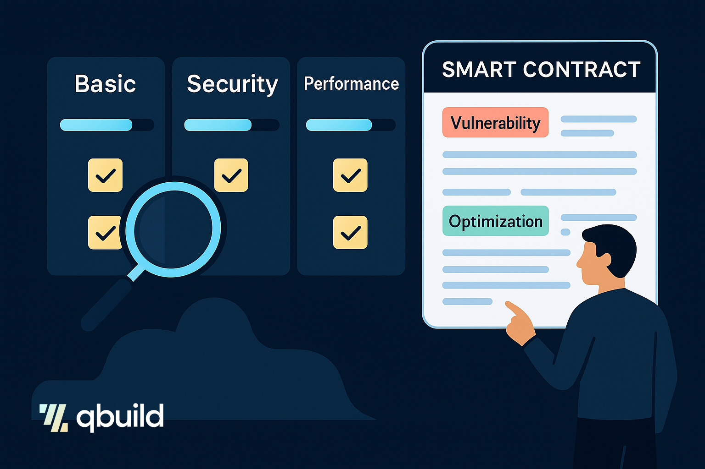
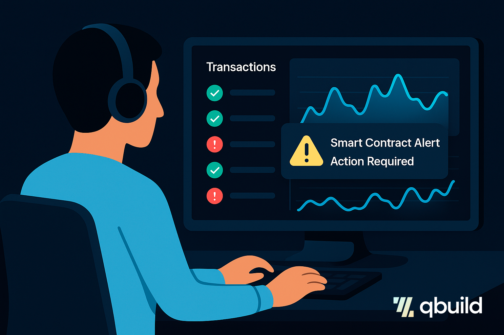
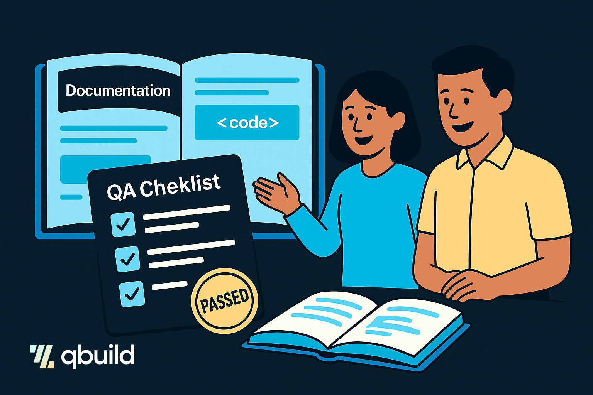

# Qbuild Proposal - Audit smart contracts on Qubic

## Proposal

---

Request to approve the budget for Kairos team to the development of the Qbuild v1.0 solution (1st winner of Qubic track at RAISE YOUR HACK 2025): $29,000

Wallet: FQJYDAAGMPTOSGYNHYOVVAANQMAAPIGZDCWKEUHBFCOTVANGLMBWMDRAHZMB

## Voting Options

- **Option 0:** Reject proposal 
- **Option 1:** Approve proposal

---

## 1. Project Overview

QBuild is a tool developed to audit, analyze, and test smart contracts written in C++ within the Qubic ecosystem. Its artificial intelligence engine detects code vulnerabilities, offers concrete recommendations, and automatically generates tests, making it easier to comprehensively validate smart contracts before their deployment on the blockchain.

QBuild’s main value lies in its ease of use (“one-click audit and test”) and its ability to democratize advanced auditing in a Web3 environment using C++, which is traditionally more complex. It is an internationally recognized, cloud-hosted platform that enhances the security and quality of Qubic developments, aimed at both developers and businesses seeking robustness in their decentralized applications.

### 1.1 Example Use Case - Generation of a New Dapp

A typical use case for QBuild involves a development team creating a new smart contract for the Qubic platform. Before deploying the contract on the main network, the team uses QBuild to perform an automated audit that detects critical vulnerabilities and security risks in the code. The tool not only identifies potential flaws but also automatically generates tests that simulate real attacks, allowing the team to validate the contract’s resilience in a safe and controlled environment.

After implementing the improvements recommended by QBuild, the smart contract becomes more robust and secure, minimizing the risk of costly errors or exploits once deployed. In this way, QBuild significantly accelerates the development cycle, reduces manual audit costs, and fosters trust both internally and within the Qubic user and validator community. This facilitates the adoption of new projects that leverage the unique capabilities of the Qubic blockchain.

### 1.2 Example User Workflow

- Upload the C++ contract files (.h/.cpp)
- Automatic AI-driven analysis (2–3 minutes)
- Generation of security report
- Review of detected vulnerabilities and test cases
- Export of results

## 2. Scope of the Proposal

Our proposal for joining the Qubic incubation program is to develop an initial version of QBuild focused on automating the auditing, analysis, and testing of smart contracts written in C++ on the Qubic blockchain. This platform will allow developers and users to upload their smart contract code, automatically detect vulnerabilities using AI-powered analysis and generate corresponding test cases.

This initial QBuild version will also include a web-based user interface where users can easily upload C++ smart contract files, configure audit parameters, review AI-generated reports, and launch test executions—all through an intuitive and accessible panel.

The scope of the proposal includes developing all core functionalities necessary for fully automated C++ contract audits within the Qubic ecosystem. This encompasses integrating static analysis, vulnerability detection and automated test generation, all accessible via a user-friendly web dashboard. Our objective is to deliver a robust, scalable, and intuitive platform that simplifies the smart contract auditing process for both individual developers and enterprise teams. By combining cutting-edge AI with practical development workflows, QBuild aims to set a new standard of security and efficiency for Qubic smart contracts, paving the way for broader adoption and ongoing innovation across the ecosystem.

**While QBuild's primary focus is on comprehensive smart contract auditing for the Qubic ecosystem, the Basic and Performance audit capabilities can be applied to any C++ codebase.** This expanded functionality allows developers to ensure their C++ code follows Core-tech recommendations and performance best practices, even for non-blockchain applications or components that integrate with smart contracts.

## 3. Functionality

### 3.1 Access to Advanced AI Language Models with Flexibility

Clients benefit from seamless integration with multiple Large Language Model providers like Groq, OpenAI, and Claude. The flexible abstraction layer allows for switching between providers to leverage the best AI capabilities available, ensuring powerful and up-to-date language intelligence tailored to specialized Web3 use cases.

### 3.2 Secure Blockchain Verification and Real-Time Transaction Monitoring

With direct Qubic blockchain RPC integration, the tool provides clients with secure, real-time contract verification and transaction validation on-chain. This transparency adds trust and accountability, critical for decentralized applications and audits within the blockchain ecosystem.

### 3.3 Comprehensive Audit Capabilities Addressing Multiple Needs

QBuild provides three distinct audit types, each designed to address specific aspects of smart contract development and deployment within the Qubic ecosystem. This multi-layered approach ensures comprehensive validation from basic compliance to advanced security testing.

#### 3.3.1 Basic Audit

The Basic Audit focuses on code quality, syntax validation, and compliance with Qubic ecosystem standards. It verifies that C++ code follows proper coding practices and meets Core-tech acceptance criteria for mainnet deployment, ensuring smart contracts are ready for production on the Qubic blockchain.

#### 3.3.2 Security Audit

The Security Audit performs vulnerability detection and exploit prevention through static code analysis and AI-powered pattern recognition. This audit is responsible for launching real transactions that include penetration testing scenarios, effectively attempting to hack and break the smart contract in a controlled environment to identify and exploit potential security vulnerabilities.

#### 3.3.3 Performance Audit

The Performance Audit evaluates smart contract efficiency and optimization opportunities within the Qubic ecosystem. It analyzes computational complexity, resource usage, and scalability to ensure optimal performance under varying transaction loads and provides recommendations for improving contract efficiency.

**Note:** *While the complete three-tier audit system is designed specifically for smart contracts, the Basic and Performance audits can be independently applied to any C++ codebase, making QBuild a versatile tool for ensuring code quality and optimization beyond smart contract development.*

### 3.4 Intuitive Frontend Interface for Live Monitoring and Alerting

Clients can access an intuitive frontend interface displaying real-time transaction statuses and verification results. Integrated notifications and user-friendly design enhance operational visibility, enabling proactive responses to critical events.

### 3.5 Full Documentation and Quality Assurance for Smooth Adoption

Comprehensive developer documentation and rigorous quality assurance processes guarantee reliability, facilitate easier onboarding for client teams, and provide a roadmap for long-term maintenance and feature expansion, ensuring sustained value and adaptability.

## 4. Tech Stack

QBuild is architected using a robust, modern technology stack designed to deliver security, scalability, and seamless user experience. Each component of the platform has been carefully selected to support automated auditing and testing of C++ smart contracts within the Qubic ecosystem. The following sections provide a high-level overview of the core technologies and their roles within QBuild.

### 4.1 Frontend Development Stack

The frontend will be built using Vite as the build tool together with React and TypeScript. TailwindCSS will implement the design system for consistent styling and user interface development. The development environment will be configured with build tools to support the initial project structure and core components implementation.

### 4.2 Multi-LLM Provider Integration Stack

Qbuild will integrate multiple large language model providers including Groq, OpenAI, and Claude. An abstraction layer will be developed to enable scalability and easy switching between providers. API endpoints will be created for LLM usage, with error handling and retry mechanisms implemented to ensure service resilience.

### 4.3 Blockchain Integration Technologies

Qubic RPC integration will be implemented through backend modules designed to interact with the blockchain. Frontend integration will handle transaction validation, with connectivity and security measures established for robust interaction.

## 5. Project Plan and Deliverables

Project planning is structured into the following phases, each of which specifies the activities and deliverables to be generated, start date, duration and dedication in hours per profile:

**Phase 0 – Project proposal:**

- **Start date:** Awaiting approval of the proposal

**Phase 1 – Project Foundation and Initial Setup**

- **Estimated Hours:** 40 hours
- **Scope:**

  - Create initial project structure using Vite with React and TypeScript
  - Set up project components, styles, and base architecture following functional and technical specifications
  - Implement initial UI components and design system with TailwindCSS
  - Configure development environment and build tools
  - Create initial project documentation and development guidelines

**Phase 2 – Multi-LLM Provider Integration**

- **Estimated Hours:** 100 hours
- **Scope:**

  - Integrate multiple Large Language Model (LLM) providers: Groq, OpenAI and Claude
  - Develop provider abstraction layer for easy switching and scaling
  - Create initial API endpoints for LLM usage
  - Implement error handling and retry mechanisms for LLM services

**Phase 3 – Blockchain Qubic RPC Integration**

- **Estimated Hours:** 100 hours
- **Scope:**

  - Integrate Qubic RPC for blockchain verification services
  - Develop backend modules for interaction with blockchain
  - Begin frontend integration for transaction verification
  - Implement blockchain connectivity and security measures

**Phase 4 – Multiple Audit Types Implementation**

- **Estimated Hours:** 140 hours
- **Scope:**

  - Develop audit mechanisms for Basic, Security, and Performance audits
  - Implement backend logic and frontend reporting dashboards
  - Ensure audit compliance and testing
  - Create comprehensive audit result visualization

**Phase 5 – Frontend Interface for Monitoring and Verification**

- **Estimated Hours:** 80 hours
- **Scope:**

  - Build frontend components for transaction monitoring and verification
  - Design system base and UI Design
  - Integrate real-time data feeds and notifications
  - User experience optimization and accessibility compliance
  - Implement responsive design and cross-browser compatibility

**Phase 6 – Comprehensive Testing and Quality Assurance**

- **Estimated Hours:** 80 hours
- **Scope:**

  - Conduct comprehensive integration testing of all platform components
  - Extensive testing of LLM provider integrations and failover scenarios
  - Blockchain integration testing with Qubic testnet and mainnet environments
  - Frontend Interface for Monitoring and Verification
  - Performance testing and optimization
  - Security testing and vulnerability assessments

**Phase 7 – Documentation and Final QA**

- **Estimated Hours:** 40 hours
- **Scope:**

  - Internal UX testing
  - Write full developer documentation covering architecture, APIs, configurations, and usage
  - Create user manuals and deployment guides
  - Prepare rollout and maintenance plans
  - Final system validation and acceptance testing

**Total Hours:** 580 hours

## 6. Budget and Payment Plan

### 6.1 Budget Breakdown

The budget required for the development of the **Qbuild v1.0** solution, according to the described scope, amounts to **$29,000**, broken down into the following items:

| Phase | USD | 
|-------|-----|
| Project Foundation and Initial Setup | 2,000 |
| Multi-LLM Provider Integration | 5,000 |
| Blockchain Qubic RPC Integration | 5,000 |
| Multiple Audit Types Implementation | 7,000 |
| Frontend Interface for Monitoring and Verification | 4,000 |
| Comprehensive Testing and Quality Assurance | 4,000 |
| Documentation and Final QA | 2,000 |
| **Total Budget Request** | **29,000** |

### 6.2 Payment Plan

Payments will be made according to the following schedule, based on the achievement of the specified milestones:

- **Milestone 0 - Proposal approval:**

  - Date: T0
  - Amount: 20% of total budget

- **Milestone 1: Core Platform Completion**

  - Date: T0 + 8 weeks + 2 weeks QA Qubic
  - Includes: Phases from 1 to 4
  - Amount: 40% of total budget

- **Milestone 2: Complete Security Testing Platform:**

  - Date: T0 + 15 weeks + 2 weeks QA Qubic
  - Includes: Phases from 5 to 7
  - Amount: 40% of total budget

Payments will be sent to the wallet FQJYDAAGMPTOSGYNHYOVVAANQMAAPIGZDCWKEUHBFCOTVANGLMBWMDRAHZMB based on the compliance of each phase milestones according to the defined breakdown.

## 7. Qbuild Roadmap

**Qbuild 2.0: specialized LLM that natively understands Qubic:**
In upcoming strategic projects for the Qubic ecosystem, the development of a specialized language model that natively understands Qubic is planned, based on fine-tuning an LLM. This project will include an automated training pipeline, a community-driven collaborative learning system, and advanced zero-prompt analysis capabilities, ensuring complete independence from external models. The technical implementation involves optimized platforms for training and local deployment, supported by a multidisciplinary team focused on backend, ML/AI, frontend, and DevOps.

**Qbuild 3.0: built-in testnet:**
This version will focus on real vulnerability validation through the integration of nodes in the Qubic testnet. This includes deploying nodes via Docker, contract deployment and execution under real conditions, along with live performance metrics and transaction analysis. Developer experience will be enhanced with tools like VSCode extensions and CI/CD plugins, and a public API will be provided for third-party integrations, enabling robust testing and improved security and performance analysis of the network.

We believe this roadmap represents a solid step forward toward advanced integration and practical validation in the blockchain space, combining specialized artificial intelligence with powerful developer tools, laying strong foundations for the growth of the Web3 ecosystem.

The future development of this roadmap is subject to the submission of corresponding proposals for Qbuild 2.0 and/or 3.0 and the approval of the necessary funding for its implementation.

## 8. Kairos Team

Throughout 2025, [Kairos](https://kairos-tek.com) has become one of the most impactful teams in the Qubic ecosystem, demonstrating its 10+ years experience and execution capacity as winners of all the hackathons organized by Qubic to date:
  - **2nd place at MAD HACK 2025** with [EasyConnect](https://kairos-tek.com/easyconnect), a solution developed through the incubation program thanks to a $25,000 prize and commercially launched in September 2025.
  - **1st place in the Qubic track of RAISE YOUR HACK 2025** with [Qbuild](https://lablab.ai/blog/the-kairos-story-at-raise).

Furthermore, Kairos members are recognized leaders in the Qubic ecosystem, active colaborators and ambassadors of the network and drivers of its expansion beyond the existing ecosystem.

### 8.1 Team Members

- **Jorge Ordovás (Cofounder and CEO):**

  - Information Technology professional with 25 years of experience in the development of products and services in many different sectors (telecommunications, payments, security, eHealth, energy, cloud, blockchain, web3).
  - Working in Blockchain consulting and development of projects based on blockchain technologies since 2015 when he cofounded [Nevtrace](https://nevtrace.com), the first Blockchain lab in Spain.
  - Senior manager working in Blockchain and Web3 product and business development since 2018 at [Telefonica](https://metaverso.telefonica.com/en/welcome-to-metaverse).
  - **LinkedIn (+10,000 followers):** [Jorge Ordovas](https://www.linkedin.com/in/jorgeordovas/)
  - **X (+6,000 followers):** [@joobid](https://x.com/joobid) and [@nevtrace](https://x.com/nevtrace)
  - **Farcaster (+3,000 followers):** [@joobid.eth](https://warpcast.com/joobid.eth) and [@nevtrace](https://warpcast.com/nevtrace)

- **Jesús Lanzarote (Cofounder and CTO)**

  - Co-founder and CTO of Loiband. He has been programming for over 25 years and has worked in the startup world for 15 years, where he has participated in all types of projects across multiple areas (eHealth, services, insurance, legal, etc.), leading teams and directly participating in design and development.
  - His current focus is on developing AI-based and Web3 projects.
  - **LinkedIn:** [Jesús Lanzarote](https://www.linkedin.com/in/jesus-lanzarote/)
    
- **Rafael Montaño (Cofounder and UXD)**

  - Co-founder of [Loiband](https://www.loiband.com/home-en), technology consultancy and UX Product Specialist, with experience in UX/UI and product design. He has led the creation of more than 10 scalable digital products.
  - His approach combines user research, prototyping, and design systems in apps, Web2, and Web3, helping startups and companies launch innovative and optimized solutions for the digital market.
  - **LinkedIn:** [Rafael Montaño](https://www.linkedin.com/in/rafael-monta%C3%B1o-marroquin/)

- **Alberto García (Web3 SRE)**
  - Professional with over 15 years of experience in technology and new business development. For the past seven years, he has worked at Telefónica specializing in Web3, leading the deployment of new blockchain platforms and the launch of new products to market.
  - Lecturer at multiple universities and business schools, delivering courses on Web3 topics.
  - **LinkedIn:** [Alberto García](https://www.linkedin.com/in/okalberto/)

### 8.2 External Collaborators

- **Pablo F. Burgueño (Non-executive Partner)**
  - Cofounder of NevTrace and a lawyer specializing in cybersecurity, privacy, and LegalTech law.
  - He currently works as a lawyer and professor at ESIC, and he is a member of INMERSIVA XR, DENAE, and ASEDA, as well as the data protection and cryptoasset spaces of the European Cybercrime Centre at Europol.
  - **LinkedIn (+13,000 followers):** [Pablo F. Burgueño](https://www.linkedin.com/in/pablofb/)
  - **X (+8,000 followers):** [@pablofb](https://x.com/pablofb)
  - **Farcaster (+2,000 followers):** [@pablofb](https://warpcast.com/pablofb)

Moreover, with more than a decade of experience in the startup and corporate ecosystem, we have a broad network of contacts, freelance professionals specialized in blockchain technology, frontend, backend, infrastructure, and more. We will involve them in the project as external collaborators if additional resources are needed to meet the defined milestones.

## 9. Conclusion

QBuild represents a groundbreaking solution for enhancing the security and reliability of smart contracts on the Qubic blockchain.

By combining advanced AI-driven static analysis with automated test generation, QBuild empowers developers and organizations to seamlessly identify and mitigate vulnerabilities specific to Qubic as well as universal risks.

Its intuitive one-click workflow democratizes access to sophisticated auditing tools, reducing both development time and potential security breaches.

With a comprehensive roadmap that includes multi-method analysis, real blockchain integration, and community-driven intelligence, QBuild is poised to become an essential pillar in the Qubic ecosystem-driving innovation, trust, and adoption of secure decentralized applications.

---

## Project Scope Disclaimer

QBuild will be developed based on the current state of external APIs and services as of the project start date (September 2025). This includes:

- LLM Provider APIs (Groq, OpenAI, Claude)
- Qubic blockchain protocol and RPC specifications
- C++ smart contract standards and deployment methods

Any changes, updates, or modifications to these external dependencies that occur during or after development are not covered under this project scope and would require separate agreements for implementation.

---

**Document Version:** 1.0  
**Last Updated:** September 19, 2025
