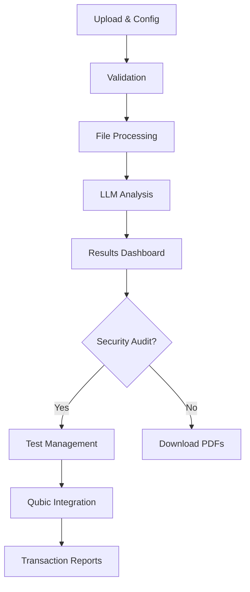
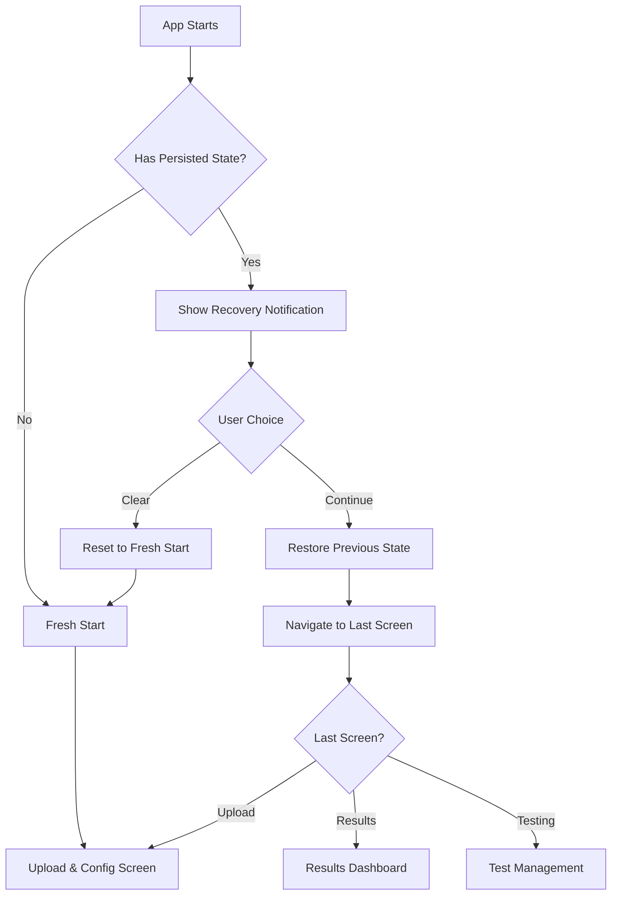

# QBuild - Technical Specifications v2.0

## Executive Summary

Complete reimplementation of **QBuild** as a frontend-only web application using **Vite + React/TypeScript**, eliminating backend and database complexity. The project focuses on providing Qubic C++ contract audits in a direct and efficient manner, where each audit session is independent and results are processed and downloaded immediately.

> **Note**: This is a technical analysis document subject to changes as development progresses. Specifications may be refined based on implementation feedback and evolving requirements.

---

## General Architecture

### Main Technology Stack

- **Framework**: Vite + React 18 + TypeScript
- **Styling**: Tailwind CSS + shadcn/ui components
- **State Management**: Zustand for global state management
- **HTTP Client**: Axios for external API calls
- **PDF Generation**: jsPDF + html2canvas for PDF generation
- **Markdown Rendering**: react-markdown + remark/rehype plugins
- **File Handling**: Native browser File API
- **Blockchain Integration**: Direct Qubic SDK/API client

### Design Principles

- **Frontend-Only**: No custom backend, direct communication with external APIs
- **Recovery Protection**: Automatic state persistence to prevent data loss on page refresh
- **Progressive**: Smooth experience with continuous visual feedback
- **Responsive**: Adaptive design for desktop and mobile
- **Accessible**: WCAG 2.1 AA compliance

### Vite-Specific Architectural Considerations

#### Hot Module Replacement (HMR) Optimization

```typescript
// Vite's HMR preserves component state during development
// Structure components to leverage HMR effectively:
export default function UploadConfigScreen() {
  // Component state preserved during HMR
  const [selectedAudits, setSelectedAudits] = useState<AuditType[]>([])

  // Event handlers optimized for HMR
  const handleAuditSelection = useCallback((audits: AuditType[]) => {
    setSelectedAudits(audits)
  }, [])

  return (
    // JSX structure
  )
}
```

#### ES Modules and Tree Shaking

```typescript
// Leverage Vite's native ESM support for optimal tree shaking
// Import only what you need from libraries
import { useState, useCallback, useMemo } from "react";
import { Button } from "@/components/ui/button";
import { Card } from "@/components/ui/card";

// Avoid barrel imports that prevent tree shaking
// ❌ import * as utils from './utils'
// ✅ import { validateFile } from './utils/file-validation'
```

#### Dynamic Imports for Code Splitting

```typescript
// Vite handles dynamic imports efficiently
const TestManagementScreen = lazy(
  () => import("./pages/TestManagement/TestManagementScreen")
);
const ResultsDashboard = lazy(
  () => import("./pages/ResultsDashboard/ResultsDashboard")
);

// Route-based code splitting
const router = createBrowserRouter([
  {
    path: "/upload",
    element: <UploadConfigScreen />,
  },
  {
    path: "/results",
    element: (
      <Suspense fallback={<LoadingSpinner />}>
        <ResultsDashboard />
      </Suspense>
    ),
  },
]);
```

#### Asset Optimization with Vite

```typescript
// Vite automatically handles asset optimization
// Use import.meta.glob for dynamic asset loading
const contractExamples = import.meta.glob("./assets/contract-examples/*.cpp", {
  as: "raw",
});

// Vite environment variables
const config = {
  apiTimeout: import.meta.env.VITE_API_TIMEOUT_MS || 30000,
  maxFileSize: import.meta.env.VITE_MAX_FILE_SIZE_MB || 10,
  isDev: import.meta.env.DEV,
  isProd: import.meta.env.PROD,
};
```

#### Page Refresh Protection

```typescript
// Automatic state recovery on page load
function usePageRefreshProtection() {
  useEffect(() => {
    // Warn user before leaving page if work in progress
    const handleBeforeUnload = (e: BeforeUnloadEvent) => {
      const auditState = useAuditStore.getState();

      if (
        auditState.isAnalyzing ||
        auditState.basicAuditResult ||
        auditState.securityAuditResult ||
        auditState.performanceAuditResult
      ) {
        e.preventDefault();
        e.returnValue =
          "You have unsaved audit results. Are you sure you want to leave?";
        return e.returnValue;
      }
    };

    window.addEventListener("beforeunload", handleBeforeUnload);

    return () => {
      window.removeEventListener("beforeunload", handleBeforeUnload);
    };
  }, []);
}

// App-level recovery component
function AppRecovery({ children }: { children: React.ReactNode }) {
  const [isRecovered, setIsRecovered] = useState(false);
  const auditState = useAuditStore();

  useEffect(() => {
    // Check if there's persisted state to recover
    const hasPersistedData =
      auditState.contractFile ||
      auditState.basicAuditResult ||
      auditState.securityAuditResult ||
      auditState.performanceAuditResult;

    if (hasPersistedData && !isRecovered) {
      // Show recovery notification
      toast.info("Previous audit session restored", {
        action: {
          label: "Clear",
          onClick: () => auditState.resetAudit(),
        },
      });
      setIsRecovered(true);
    }
  }, []);

  return <>{children}</>;
}
```

#### Vite Plugin Integration

```typescript
// Custom Vite plugin for contract validation
function contractValidationPlugin() {
  return {
    name: "contract-validation",
    transform(code: string, id: string) {
      if (id.includes("contract-templates")) {
        // Pre-process contract templates at build time
        return validateAndTransformContract(code);
      }
    },
  };
}

// Integration with development tools
export default defineConfig({
  plugins: [
    react(),
    contractValidationPlugin(),
    // PWA support for offline capability
    VitePWA({
      registerType: "autoUpdate",
      workbox: {
        globPatterns: ["**/*.{js,css,html,ico,png,svg}"],
      },
    }),
  ],
});
```

---

## Component Architecture

### Directory Structure

```
src/
├── components/           # Reusable components
│   ├── ui/              # shadcn/ui base components
│   ├── common/          # Common components (headers, buttons, etc.)
│   └── features/        # Feature-specific components
├── pages/               # Main pages (3 screens)
│   ├── UploadConfig/    # Screen 1: Upload & Configuration
│   ├── ResultsDashboard/ # Screen 2: Results Dashboard
│   └── TestManagement/  # Screen 3: Test Management
├── services/            # Services and external integrations
│   ├── llm/            # LLM integrations (Groq, OpenAI, Claude)
│   ├── qubic/          # Qubic blockchain integration
│   └── pdf/            # PDF generation service
├── stores/              # Zustand stores for global state
├── types/               # TypeScript type definitions
├── utils/               # Utilities and helpers
├── hooks/               # Custom React hooks
└── assets/              # Static resources
```

### Global State Management (Zustand)

#### AuditStore

```typescript
interface AuditStore {
  // Audit configuration
  selectedAudits: AuditType[];
  llmConfig: LLMConfig;
  contractFile: File | null;

  // Audit results
  basicAuditResult: AuditResult | null;
  securityAuditResult: AuditResult | null;
  performanceAuditResult: AuditResult | null;

  // Execution state
  isAnalyzing: boolean;
  analysisProgress: number;

  // Actions
  setSelectedAudits: (audits: AuditType[]) => void;
  setLLMConfig: (config: LLMConfig) => void;
  setContractFile: (file: File) => void;
  startAnalysis: () => Promise<void>;
  resetAudit: () => void;
}

// Zustand persistence middleware for automatic state recovery
const auditStore = create<AuditStore>()(
  persist(
    (set, get) => ({
      // ... store implementation
    }),
    {
      name: "qbuild-audit-state",
      storage: createJSONStorage(() => sessionStorage), // Clears on browser close
      partialize: (state) => ({
        // Only persist essential data for recovery
        selectedAudits: state.selectedAudits,
        llmConfig: { ...state.llmConfig, apiKey: "" }, // Don't persist API keys
        contractFile: state.contractFile,
        basicAuditResult: state.basicAuditResult,
        securityAuditResult: state.securityAuditResult,
        performanceAuditResult: state.performanceAuditResult,
        analysisProgress: state.analysisProgress,
      }),
    }
  )
);
```

#### TestingStore (Security Audit Only)

```typescript
interface TestingStore {
  // Blockchain configuration
  qubicConfig: QubicConfig;

  // Test cases and execution
  testCases: SecurityTestCase[];
  executionStatus: TestExecutionStatus;
  currentTick: number;
  highestTransactionTick: number;

  // Results
  testResults: TestResult[];
  transactionReport: TransactionReport | null;

  // Actions
  setQubicConfig: (config: QubicConfig) => void;
  executeTests: (selectedTests: string[]) => Promise<void>;
  generateTransactionReport: () => Promise<void>;
}

// Testing store with persistence for recovery
const testingStore = create<TestingStore>()(
  persist(
    (set, get) => ({
      // ... store implementation
    }),
    {
      name: "qbuild-testing-state",
      storage: createJSONStorage(() => sessionStorage),
      partialize: (state) => ({
        // Persist test progress and results
        qubicConfig: { ...state.qubicConfig, privateKey: "" }, // Don't persist sensitive data
        testCases: state.testCases,
        testResults: state.testResults,
        currentTick: state.currentTick,
        highestTransactionTick: state.highestTransactionTick,
        transactionReport: state.transactionReport,
      }),
    }
  )
);
```

#### TestingStore (Security Audit Only)

```typescript
interface TestingStore {
  // Blockchain configuration
  qubicConfig: QubicConfig;

  // Test cases and execution
  testCases: SecurityTestCase[];
  executionStatus: TestExecutionStatus;
  currentTick: number;
  highestTransactionTick: number;

  // Results
  testResults: TestResult[];
  transactionReport: TransactionReport | null;

  // Actions
  setQubicConfig: (config: QubicConfig) => void;
  executeTests: (selectedTests: string[]) => Promise<void>;
  generateTransactionReport: () => Promise<void>;
}
```

---

## Screen Specifications

### 1. Upload & Configuration Screen

#### Main Components

```typescript
// Main component
<UploadConfigScreen />
├── <AuditTypeSelector />     // Multi-checkbox selection
├── <LLMConfigSection />      // Provider + API key
├── <FileUploadZone />        // Drag & drop + file validation
├── <AdvancedOptions />       // Collapsible advanced settings
└── <StartAnalysisButton />   // Primary CTA

// Props and Local State
interface UploadConfigProps {
  onStartAnalysis: (config: AnalysisConfig) => void
}

interface UploadConfigState {
  selectedAudits: Set<AuditType>
  llmProvider: LLMProvider
  apiKey: string
  contractFile: File | null
  maxTokens: number
  isValid: boolean
}
```

#### Real-time Validations

- **Audit Selection**: At least one type selected
- **API Key**: Format validation + optional connectivity test
- **File Upload**: Extension validation (.h, .cpp) + maximum size
- **Form State**: "Start Analysis" button enablement
- **Session Storage**: Available storage space validation

#### Session Management Features

```typescript
// Session import/export functionality
interface SessionImportExport {
  // Export session as downloadable file
  exportSession(sessionId: string, format: "json" | "zip"): Promise<Blob>;

  // Import session from uploaded file
  importSession(file: File): Promise<{
    sessionId: string;
    conflicts?: SessionConflict[];
  }>;

  // Handle session conflicts during import
  resolveConflicts(
    conflicts: SessionConflict[],
    resolutions: ConflictResolution[]
  ): Promise<void>;
}

interface SessionConflict {
  type: "duplicate_id" | "newer_version" | "missing_dependencies";
  existingSession: SavedSession;
  importedSession: SavedSession;
  message: string;
}

// Session sharing (optional - for team environments)
interface SessionSharing {
  // Generate shareable session link (encrypted)
  createShareLink(
    sessionId: string,
    permissions: SharePermissions
  ): Promise<string>;

  // Load session from share link
  loadFromShareLink(shareLink: string): Promise<AuditSessionData>;
}

// Storage quota management
interface StorageManagement {
  getQuotaUsage(): Promise<{
    used: number;
    available: number;
    percentage: number;
  }>;

  suggestCleanup(): Promise<{
    oldSessions: SavedSession[];
    largeSessions: SavedSession[];
    potentialSavings: number;
  }>;

  performCleanup(targets: string[]): Promise<number>; // returns bytes freed
}
```

#### LLM Integration

```typescript
// Service abstraction for multiple providers
interface LLMService {
  provider: 'groq' | 'openai' | 'claude'
  validateApiKey(key: string): Promise<boolean>
  analyzeContract(code: string, auditType: AuditType): Promise<AuditResult>
}

// Specific implementations
class GroqService implements LLMService { ... }
class OpenAIService implements LLMService { ... }
class ClaudeService implements LLMService { ... }
```

### 2. Results Dashboard Screen

#### Dynamic Components

```typescript
<ResultsDashboardScreen />
├── <AnalysisSummaryHeader />     // Contract info + badges
├── <PrimaryActions />            // "Execute Security Tests" + "New Analysis"
└── <DynamicResultsSections />    // Conditional rendering
    ├── <BasicAuditSection />     // If Basic Audit selected
    ├── <SecurityAuditSection />  // If Security Audit selected
    └── <PerformanceAuditSection /> // If Performance Audit selected

// Each section is a collapsible component
<AuditResultSection>
├── <CollapsibleHeader />         // Title + expand/collapse
├── <MarkdownContent />           // HTML rendering of markdown
└── <SectionActions />            // Download PDF + specific actions
```

#### Markdown Rendering

```typescript
// react-markdown configuration with plugins
const markdownConfig = {
  remarkPlugins: [remarkGfm, remarkBreaks],
  rehypePlugins: [rehypeHighlight, rehypeSanitize],
  components: {
    code: CustomCodeBlock,
    table: CustomTable,
    // ... custom components
  },
};
```

#### PDF Generation

```typescript
interface PDFGenerationService {
  generateBasicAuditPDF(
    content: string,
    metadata: AuditMetadata
  ): Promise<Blob>;
  generateSecurityAuditPDF(
    content: string,
    metadata: AuditMetadata
  ): Promise<Blob>;
  generatePerformanceAuditPDF(
    content: string,
    metadata: AuditMetadata
  ): Promise<Blob>;
}

// Implementation using jsPDF + html2canvas
class PDFService implements PDFGenerationService {
  // Converts markdown to HTML, applies styles and generates PDF
}
```

### 3. Test Management Screen

#### Specialized Components

```typescript
<TestManagementScreen />
├── <BlockchainConfigPanel />     // Qubic connection settings
├── <CurrentTickStatusPanel />    // Real-time tick monitoring
├── <TestCasesTable />           // Test selection + execution
├── <ExecutionMonitor />         // Progress tracking
└── <TransactionReportSection /> // Final report generation

// Qubic connection state
interface QubicConnectionState {
  endpoint: string
  contractAddress: string
  contractIndex: number
  isConnected: boolean
  currentTick: number
  connectionStatus: 'disconnected' | 'connecting' | 'connected' | 'error'
}
```

#### Qubic Blockchain Integration

```typescript
interface QubicService {
  // Connection and state
  connect(config: QubicConfig): Promise<void>;
  getCurrentTick(): Promise<number>;
  getConnectionStatus(): ConnectionStatus;

  // Test execution
  submitTransaction(testCase: SecurityTestCase): Promise<TransactionResult>;
  getTransactionStatus(txId: string): Promise<TransactionStatus>;

  // Result querying
  queryTransaction(txId: string, tick: number): Promise<TransactionDetails>;
}

// WebSocket for real-time tick updates
class QubicTickMonitor {
  onTickUpdate: (tick: number) => void;
  startMonitoring(): void;
  stopMonitoring(): void;
}
```

#### Test Execution States

```typescript
type TestExecutionStatus =
  | "not_executed"
  | "queued"
  | "executing"
  | "waiting_for_tick"
  | "verifying"
  | "logged"
  | "failed";

interface TestResult {
  testId: string;
  status: TestExecutionStatus;
  executionTick?: number;
  transactionId?: string;
  result?: any;
  timestamp: Date;
}
```

---

## Services and Integrations

### LLM Integration Service

```typescript
interface LLMIntegrationConfig {
  retryAttempts: number;
  timeoutMs: number;
  rateLimiting: {
    requestsPerMinute: number;
    tokensPerMinute: number;
  };
}

class LLMIntegrationService {
  private providers: Map<LLMProvider, LLMService>;

  async executeAnalysis(
    contractCode: string,
    auditTypes: AuditType[],
    config: LLMConfig
  ): Promise<AuditResults> {
    // Parallel execution of multiple audit types
    // Error handling and retries
    // Rate limiting and timeout handling
  }
}
```

### File Processing Service

```typescript
interface FileProcessor {
  validateContractFile(file: File): Promise<ValidationResult>;
  extractContractMetadata(content: string): ContractMetadata;
  preprocessContractCode(content: string): string;
}

interface ContractMetadata {
  contractName: string;
  namespace: string;
  functions: ContractFunction[];
  procedures: ContractProcedure[];
  structs: ContractStruct[];
}
```

### PDF Generation Service

```typescript
interface PDFTemplate {
  header: PDFHeaderConfig;
  footer: PDFFooterConfig;
  styles: PDFStyleConfig;
  layout: PDFLayoutConfig;
}

class PDFGenerationService {
  private templates: Map<AuditType, PDFTemplate>;

  async generateAuditPDF(
    auditResult: AuditResult,
    auditType: AuditType,
    metadata: AuditMetadata
  ): Promise<Blob> {
    // HTML to PDF conversion with custom styling
    // Page breaks, headers, footers
    // Embedded images and charts
  }
}
```

---

## Data Flow and States

### Main Audit Flow



### Global Application State

```typescript
interface AppState {
  // Navigation
  currentScreen: ScreenType;
  navigationHistory: ScreenType[];

  // Configuration
  auditConfig: AuditConfiguration;

  // Current audit session
  auditSession: AuditSession | null;

  // UI State
  isLoading: boolean;
  loadingMessage: string;
  errors: ErrorState[];
  notifications: Notification[];

  // Recovery state
  hasRecoveredData: boolean;
}

interface AuditSession {
  id: string;
  configuration: AuditConfiguration;
  results: AuditResults;
  testResults?: SecurityTestResults;

  // Progress tracking
  isAnalyzing: boolean;
  analysisProgress: number;
}
```

### Data Recovery Flow



### Error Management

```typescript
interface ErrorHandling {
  // Error types
  apiErrors: LLMApiError[];
  validationErrors: ValidationError[];
  networkErrors: NetworkError[];
  qubicErrors: QubicError[];

  // Recovery strategies
  retryStrategies: Map<ErrorType, RetryStrategy>;
  fallbackBehaviors: Map<ErrorType, FallbackBehavior>;

  // UI Error States
  errorBoundaries: ErrorBoundaryConfig[];
  userFeedback: ErrorFeedbackConfig;
}
```

---

**Document Version:** 1.0  
**Last Updated:** August, 27, 2025  
**Status:** Complete Technical Specification
